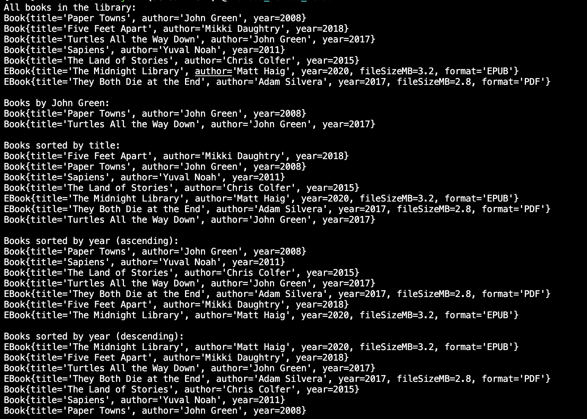
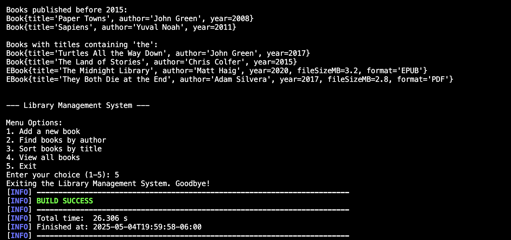
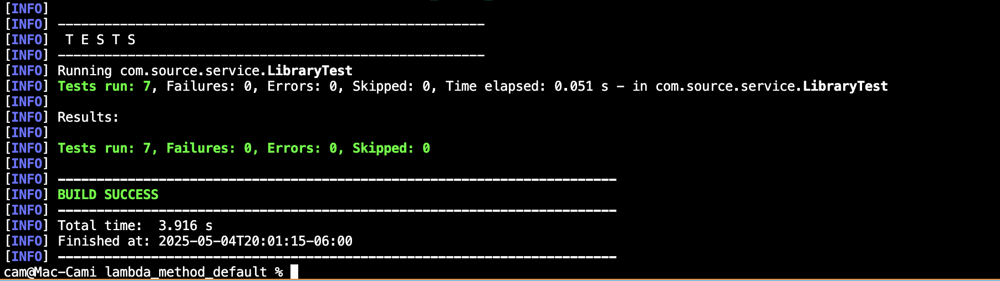

# Lambda Expressions, Method References, and Default Methods in Java

## Archivos Implementados

### Modelo

1. **`Book.java`**
   - Clase básica con atributos de libro (título, autor, año de publicación)
   - Incluye constructores, getters, setters y un método toString()

2. **`EBook.java`**
   - Subclase de Book que agrega atributos específicos para libros electrónicos (tamaño del archivo, formato)
   - Extiende la funcionalidad de Book manteniendo la herencia adecuada

### Servicios

3. **`BookManager.java`**
   - Interfaz que define operaciones básicas para la gestión de libros
   - **Uso de método por defecto**: 
     ```java
     default void printAllBooks() {
         getBooks().forEach(System.out::println);
     }
     ```
   - Este método por defecto utiliza una **referencia a método** (System.out::println)

4. **`Library.java`**
   - Implementa la interfaz BookManager
   - **Uso de expresiones Lambda**:
     - En el método `findBooksByAuthor`:
       ```java
       return books.stream()
               .filter(book -> book.getAuthor().equalsIgnoreCase(author))
               .collect(Collectors.toList());
       ```
     - En el método `sortBooksByTitle`:
       ```java
       return books.stream()
               .sorted((b1, b2) -> b1.getTitle().compareTo(b2.getTitle()))
               .collect(Collectors.toList());
       ```
     - En el método `findBooksByTitleContaining`:
       ```java
       return books.stream()
               .filter(book -> book.getTitle().toLowerCase().contains(substring.toLowerCase()))
               .collect(Collectors.toList());
       ```

### Main

5. **`Main.java`**
   - Punto de entrada de la aplicación
   - Crea una biblioteca, agrega libros y demuestra las diferentes operaciones
   - **Uso de referencias a método**:
     ```java
     booksByAuthor.forEach(System.out::println);
     ```
   - Menú para demostrar la funcionalidad

### Testing

6. **`LibraryTest.java`**
   - Pruebas unitarias para verificar la correcta implementación de Library
   - Verifica las operaciones de filtrado (expresiones Lambda) y ordenamiento

## Características Java 8 Implementadas

### 1. Expresiones Lambda
- Utilizadas para filtrar libros por autor:
  ```java
  .filter(book -> book.getAuthor().equalsIgnoreCase(author))
  ```
- Utilizadas para ordenar libros por título:
  ```java
  .sorted((b1, b2) -> b1.getTitle().compareTo(b2.getTitle()))
  ```
- Utilizadas en métodos adicionales para filtrar y ordenar por diferentes criterios

### 2. Referencias a Método
- Utilizadas para imprimir todos los libros:
  ```java
  getBooks().forEach(System.out::println);
  ```
- Utilizadas en la clase Main para imprimir resultados:
  ```java
  booksByAuthor.forEach(System.out::println);
  ```

### 3. Métodos por Defecto
- Implementado en BookManager:
  ```java
  default void printAllBooks() {
      getBooks().forEach(System.out::println);
  }
  ```

## Compilación y Ejecución

Entrar a la carpeta correcta:
```
cd lambda_method_default
```

Para compilar el proyecto:
```
mvn clean compile
```

Para ejecutar la aplicación:
```
mvn exec:java -Dexec.mainClass="com.source.Main"
```

Para ejecutar los test:
```
mvn test
```

## Funcionalidades Adicionales

- Ordenamiento de libros por año (ascendente y descendente)
- Filtrado de libros por año de publicación
- Filtrado de libros por texto en el título


## Evidencia de funcionamiento:

### Main



### Tests

